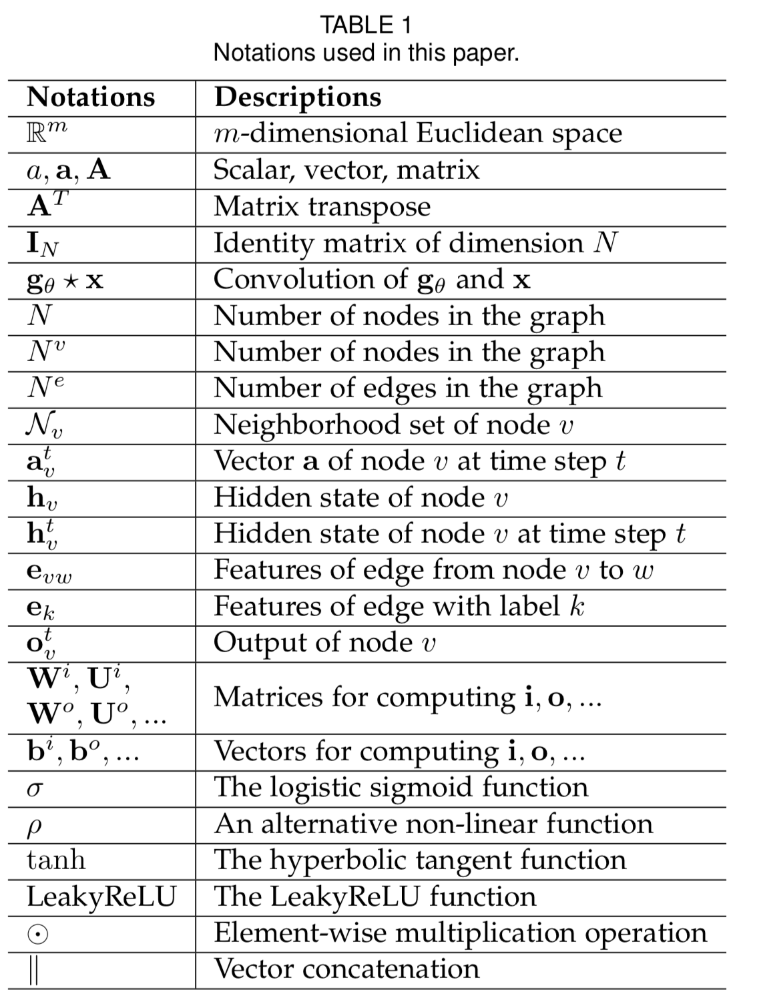
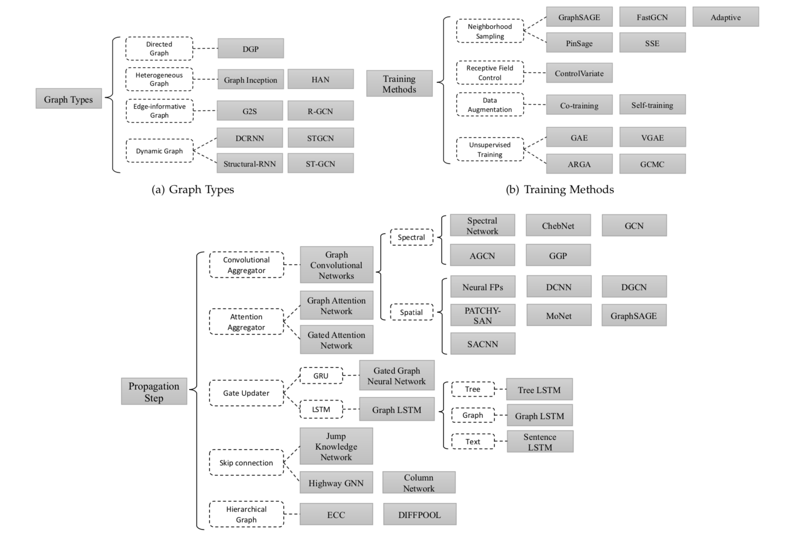
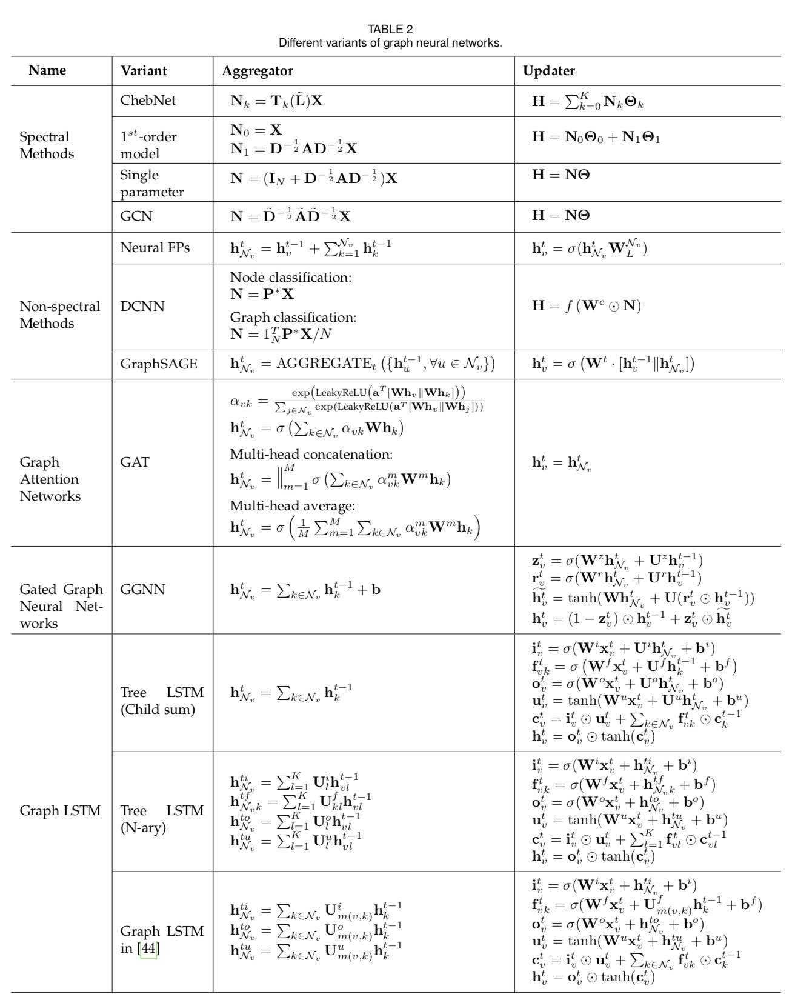

- 原文链接见[此处](https://arxiv.org/abs/1812.08434)

# Abstract
> 许多学习任务需要处理图形数据，该图形数据包含元素之间的丰富关系信息。 建模物理系统，学习分子指纹，预测蛋白质界面以及对疾病进行分类都需要一个模型来从图形输入中学习。

>  在诸如从文本和图像之类的非结构数据中学习的其他领域中，对提取的结构的推理，例如句子的依存关系树和图像的场景图，是一个重要的研究课题，它也需要图推理模型。

> GNN(`Graph Neural Network`)是连接器模型，可通过在图的节点之间传递消息来捕获图的依赖性。 与标准神经网络不同，图神经网络保留了一个状态，该状态可以表示来自其邻域的任意深度的信息。尽管发现原始GNN难以在固定点(隐态$\mathbf{h}$已经收敛的点)上进行训练，但是网络体系结构，优化技术和并行计算的最新进展已使他们能够成功学习。 近年来，基于图神经网络变体的系统，例如图卷积网络（GCN,`Graph Convolutional Network`)），图注意力网络（GAT,`Graph Attention Network`)），门控图神经网络（GGNN,`Gated Graph Neural Network`)），已在上述许多任务上展现了突破性的性能。 
> 在本次调查中，我们对现有的图神经网络模型进行了详细的回顾，对应用程序进行了系统分类，并提出了四个未解决的问题，以供将来研究。

# 本文的组织结构
1. **Introduction** 综述GNN及其背景介绍
2. **Model** 
   2.1 **Graph Neural Networks** 介绍了由[^1]提出的原始GNN，并列出其在表征能力、计算效率上的局限性
   2.2 **Variants of Graph Neural Networks** 介绍了几个为了解决局限性的变体GNN，他们对不同类型的图进行操作，实现了不同的传播函数以及先进的训练方法
   2.3 **General Frameworks** 提出3个通用框架(`MPNN,NLNN,GN`)，他们分别推广扩展了不少工作。
3. **Applications** 介绍GNN在结构化场景、非结构化场景、其他场景下的主要应用
4. **Problems** 提出四个对于gnn的公开问题及研究方向
5. **Conclusion** 

# Introduction
图作为数据结构对一系列的对象及其关系建模，即点与边，图状数据的表述能力优于其他的数据结构。对于机器学习而言，因为图是唯一的非欧几里得数据结构，一般分析问题着重于点分类、链接预测和聚类。GNN拥有可信的表现及良好的可解释性。

## GNN出现的动机
### GNN的初始动机基于CNN(`Convolutional Neural Network`)
CNN具有提取多尺度的局部空间特征并将其组合起来构建具有高表达性表征的能力。CNN的关键是：局部的链接、共享的权值、多层的叠加。而这些对于解决图域问题也具有重要意义。
  - 图是最典型的局部链接结构
  - 与传统谱图理论相比，共享权值降低了计算成本
  - 多层结构是处理分层模式的关键，分层模式能够捕获不同大小的特征

CNN只能处理图像、文本等常规欧氏数据(矩阵、序列按规则排列)，而这些数据结构可以看作图的实例。因此很容易让人想到将CNN扩展的图，然而定义局部卷积滤波器、池化运算是困难的

### 另外的动机来源于图嵌入
图嵌入即用模型学习如何将图的点、边、子图表征成低维度的向量(参考`word2vec`)，在图分析领域，传统的机器学习通常依赖于手工设计特征，并受限于其低灵活性和高成本。
> DeepWalk是首个图嵌入算法，其应用表征学习、单词嵌入的思想，将skip-gram应用于生成的随机游动。
> 类似的算法node2vec LINE TADW取得突破，但编码器不共享参数，导致其计算效率低，参数个数随着节点数呈线性增长，其次直接嵌入导致其缺乏泛化能力，不能处理动态图及泛化到新的图上。

基于图嵌入、CNN,GNN被提出用语从图结构中对信息进行聚合，因为他们能对预算和他们依赖关系构成的输入或输出建模，此外，GNN可以利用RNN核同时对图上的扩散过程建模。

## 为何图网络值得被研究？
- 基础网络如CNN、RNN不能很好地处理图输入，因为他们按照特定地顺序叠加节点的特征，然而，图中没有节点的自然顺序。为了完整表示一个图，如果我们像CNN、RNN一样遍历所有可能的顺序作为模型输入，这在计算时是非常冗余的。为了解决这个问题，GNN分别在每个节点上传播，忽略节点的输入顺序。**GNN的输出对于节点的输入顺序是不变的**
- 图中的边表示两个点之间的依赖信息，而在标准神经网络中，依赖信息只是节点的特征，但是GNN可以在图形结构的指引下传播，而不是将其用作特征一部分。一般而言，GNN用他邻近点状态加权求和来更新节点的隐态。
- 人脑的推理过程几乎是基于从日常中提取的图形。标准的nn已经显示出通过学习数据分布合成图形和文档的能力，而他们仍**不能从大型实验数据中学习推理图，因此需要更高的可解释性**。然而，GNNs探索从场景图片和故事文档等非结构化数据中生成Graph，这对于进一步的高级人工智能是一个强大的神经模型。最近，已经证明了一个未经训练的简单架构的GNN也可以很好地执行。

## 本文所做出的主要贡献
- 详细回顾了现存的gnn模型，介绍了原始模型、变体和几个通用框架。提供一个统一的表示方法来表征不同模型中的传播方式，通过识别对应的聚合器、更新器可以很容易地用该表征方式来区分不同的模型
- 系统地对应用进行分类，将应用分为结构场景、非结构场景和其他场景。介绍了GNN主要的应用及对应的在不同场景下所使用的方法
- 提出四个开放问题针对未来的研究。图神经网络存在**过度平滑和缩放问题**。目前还没有有效的方法来**处理动态图以及对非结构感测数据进行建模**。

---
# Model

## 2.0 文中用到符号参考


<!--   -->

## 2.1 原始Graph Neural Networks
[^1]提出GNN的目的是扩展当时现存的神经网络去处理在图领域表征的数据。在图中，很自然让人想到，节点信息是由其本身的特征及其相关点(邻近点)所定义。GNN的目标则是去学习一个对于每个节点的嵌入隐态(参考RNN中的hidden state概念)$\mathbf{h}_v \in \mathbb{R}^s$，其含有来自邻近点及自身的信息。而$h_v$又能用于计算$\mathbf{o}_v$即点$v$的输出，有时这个输出可以是点的标记(分类问题中的label)
- $f$——局部转移函数(参数方程),由所有节点共享，根据输入邻近点来更新当前点$v$的状态
- $g$——局部输出函数，用于描述$\mathbf{o}_v$的产生
- $\mathbf{x}_v$,$\mathbf{x}_{co[v]}$——点$v$及其边的特征
- $\mathbf{h}_{ne[v]}$——点$v$邻近点的隐态
- $\mathbf{x}_{ne[v]}$——点$v$邻近点的特征

则$\mathbf{h}_v$,$\mathbf{o}_v$可见如何定义：
$$\begin{equation}
\mathbf{h}_v = f(\mathbf{x}_v,\mathbf{x}_{co[v]},\mathbf{h}_{ne[v]},\mathbf{x}_{ne[v]})
\end{equation}$$
$$\begin{equation}
\mathbf{o}_v=g(\mathbf{h}_v,\mathbf{x}_v)
\end{equation}$$

- $\mathbf{H}$ 所有点$v_1,v_2...v_i$隐态$\mathbf{h}_{v}$叠加而成的向量
- $\mathbf{O}$ 所有点$v_1,v_2...v_i$输出$\mathbf{o}_{v}$叠加而成的向量
- $\mathbf{X}$ 所有特征(包括点、边)$\mathbf{x}_{v}$,$\mathbf{x}_{co[v]}$叠加而成的向量
- $\mathbf{X}_N$ 所有点$v_1,v_2...v_i$节点特征$\mathbf{x}_{v}$叠加而成的向量
- $F$,$G$分别为全局转移函数、全局输出函数分别由$f$,$g$叠加而成

以上等式可组合成：
$$\begin{equation}
\mathbf{H} = F(\mathbf{H},\mathbf{X})
\end{equation}$$
$$\begin{equation}
\mathbf{O} = G(\mathbf{H},\mathbf{X_N})
\end{equation}$$

$\mathbf{H}$的值是等式(3)中的不动点，在$F$是收缩映射的假设下唯一定义。翻译成人话就是**在不断迭代中若F使**$\mathbf{H}^t$**收敛到某一点,则这一点将由F所决定，也即不同的F会让其收敛到不同的点**(可谷歌关键词`contraction mapping` 或 `收缩映射`)
GNN根据巴拿赫不动点定理[^2]的建议，采用经典的迭代方案计算状态:
$$\begin{equation}
\mathbf{H}^{t+1} = F (\mathbf{H}^t,\mathbf{X})
\end{equation}$$

- $\mathbf{H}^t$——$\mathbf{H}$的第t次迭代结果

对于任意初始值$\mathbf{H}(0)$，动态系统等式(5)呈指数级快速收敛到等式(3)的解。因此f和g中描述的计算可以解释为前馈神经网络。以上即GNN的基本框架，则现在的问题是如何计算$f$和$g$，由监督可获得目标的信息$\mathbf{t}_v$（点$v$的标记），目标损失函数可以如下定义
$$\begin{equation}
loss = \sum_{i=1}^{p}(\mathbf{t}_i-\mathbf{o}_i)
\end{equation}$$
- $p$是被监督节点的数量

学习算法可基于梯度下降的策略，学习算法由以下的步骤组成：
1. 隐态$\mathbf{h}_v^t$由等式(1)迭代更新直到第$T$次，让其接近(3)的不动点解，$\mathbf{H}(T)\approx \mathbf{H}$
2. 从损失函数开始依次计算权重$\mathbf{W}$的梯度
3. 用上一次迭代计算的$\mathbf{W}^{t-1}$的梯度来更新$\mathbf{W}^t$

### 原始模型/框架的限制
- 对不动点的迭代中更新节点的$\mathbf{h}$是低效的，如果放松不动点的假设，我们可以设计一个多层GNN来获得节点及其邻近点的稳定表示。
- GNN在迭代过程中共享参数，而其他神经网络则在不同层使用不同参数以此来分层提取特征。而节点隐态的更新又是一个序列过程，可以参考GRU、LSTM等RNN的内核来进行。
- 原始GNN无法有效的对边伤的信息特征建模，知识图中的边具有关系的类型，通过边的信息传播应该根据边的类型而有所不同。因此如何学习边上的隐态也是一个重要的点。
- 如果我们把重点放在节点的表示上而不是图上，就不适合使用不动点，因为在不动点上表示的分布将会非常平滑，而且区分每个节点的信息量也会减少。 (**?**)

## 2.2 GNN的变体
### 2.2.0 分类图

<!--   -->
### 2.2.1 根据输入图的类型分类
[^1]所提到的原始GNN的输入图由带有标记信息的点及无向边组合而成，是最简单的图模式，然而世界上还有很多图的变种...
1. **有向图** 无向边又可视为双向的有向边，有向边比无向边能带来更多信息,`DGP`[^3]模型就用了$\mathbf{W}_p$,$\mathbf{W}_c$两个权重矩阵来提取有向边更准确的结构信息。传播规则如下：其中$\mathbf{D}_p^{-1}\mathbf{A}_p$,$\mathbf{D}_c^{-1}\mathbf{A}_c$分别是父节点、子节点的归一化后的邻接矩阵。
$$\begin{equation}
\mathbf{H}^t = \sigma(\mathbf{D}_p^{-1}\mathbf{A}_p\sigma(\mathbf{D}_c^{-1}\mathbf{A}_c\mathbf{H}^{t-1}\mathbf{W}_c)\mathbf{W}_p)
\end{equation}$$

2. **异构图(`Haterogeneous Graphs`)** 不同的点具有不同的类型，最简单的方法就是将点的类型转换为一个与原始特征$\mathbf{x}_v$链接的one-hot特征向量。`GraphInception`将元路径的概念引入异构图的传播中。`HAN(Heterogeneous graph attention network)`最近被提出，其利用节点级和语义级的注意力机制，它具有同时考虑节点重要性和元路径的能力。
> 使用元路径，我们可以根据邻近的节点类型和距离对它们进行分组。对于每个邻居组，GraphInception将其作为一个同构图中的子图进行传播，并将来自不同同构图的传播结果连接起来，以进行一个集合节点表征。
3. **带边信息的图** 边上带有额外的信息如权重、类型等。此类图有两种方案：
   3.1. 将图转换成二分图，在起始点和终点间插入一个新节点以代表边上的信息，因此一条原边被分成了两条新边。`G2S`的编码器对邻近点用了以下聚合器(8)。
   3.2. 对不同类型的节点传播采用不同的权重矩阵。而当边(relations)的数量很大的时候，`r-GCN`引入了两种正则化方法来减少对关系数量建模的参数：基分解、块对角分解。则边权重矩阵$\mathbf{W}_r$见等式(9)。在块对角分解中，`r-GCN`通过对一组低维矩阵直接求和来定义每个$\mathbf{W}_r$，该矩阵比第一个矩阵(9)需要更多的参数。

$$\begin{equation}
\mathbf{h}_v^t = \rho(\frac{1}{|\mathcal{N}_v|}\sum_{u\in\mathcal{N}_v}\mathbf{W}_r(\mathbf{r}_v^t\odot\mathbf{h}_u^{t-1})+\mathbf{b}_r)
\end{equation}$$
- $\mathbf{W}_r$，$\mathbf{b}_r$ 是对于不同种类边的传播参数(r for the type of relations)。
- $\mathbf{r}_v^t$ *笔者认为这是当前relation即边节点上的特征信息，详细可读G2S原文*[^4]

$$\begin{equation}
\mathbf{W}_r = \sum_{1}^{B}a_{rb}\mathbf{V}_b
\end{equation}$$
- $\mathbf{V}_b$——基变换矩阵 $\mathbf{V}_b \in \mathbb{R}^{d_{in}\times d_{out}}$
- $\mathbf{W}_r$——对$\mathbf{V}_b$的线性组合
4. **动态图** 具有静态的图结构和动态的输入信号。为了捕捉这两类信息，`DCRNN`、`STGCN`首先通过GNN收集空间信息，然后将输出输入到序列模型(seq-seq,CNN,RNN)中。不同的是，结构化的RNN和`STGCN`同时采集时间(序列)、空间(分布)信息，他们利用时空上的链接来扩展静态图结构，从而将传统的gnn应用到扩展图上。

### 2.2.2 根据传播步骤分类
传播、输出step是模型获取隐态最关键的部分。在原图神经网络模型的传播步骤中主要有如下介绍的几个修改，而研究人员通常在输出步骤中遵循一个简单的前馈神经网络设置。变体间的主要区别在于从邻近点收集信息的聚合器以及用于更新节点隐态的迭代更新器。

<!--   -->
#### Convolution 
目前越来越多人将卷积推广到图领域，而这方面的进展通常分为谱方法和非谱(空间谱)方法，谱方法一般配合图的一个空间谱表征来使用。
1. Spectral approaches (空间)谱方法
   - `Spectral Network`(谱网络)。通过计算图的拉普拉斯变换的特征分解，让我们在傅立叶域下定义了卷积运算。卷积运算又可以定义成一个信号$\mathbf{x}\in \mathbb{R}^N$和一个滤波器(filter)$\mathbf{g}_\theta = diag(\theta),\theta\in\mathbb{R}^N$的乘法,见等式(10)。这种运算会导致**潜在的密集计算和滤波器的非空间局部化(?)**，有试图引入一个光滑系数的参数化来是谱滤波器在空间上局部化。
   - `ChebNet`提出$\mathbf{g}_\theta(\Lambda)$可以近似至一个切比雪夫多项式$\mathbf{T}_k(x)$到$K^{th}$阶的截断展开。则运算改为可见(11)。由于拉普拉斯多项式是K次多项式，所以可以看出该操作是K局部的。ChebNet利用K局部卷积来定义卷积神经网络，这样就不需要计算拉普拉斯矩阵的特征向量。 **(?)**
   - `GCN`将分层卷积运算限制为K=1，以解决节点度分布非常广的图在局部邻近结构过拟合的问题。它进一步接近于$\lambda_{max}\approx2$的情况，见等式(12)。累加卷积运算会导致数值的不稳定、梯度的徒增或消失，为此[^5]引入了重新正则化的操作。于是推广出对信号$\mathbf{X}$的定义见(13)

$$\begin{equation}
\mathbf{g}_\theta \star \mathbf{x} = \mathbf{U}\mathbf{g}_\theta(\Lambda)\mathbf{U}^T\mathbf{x}
\end{equation}$$

- $\mathbf{U}$——归一化 图的拉普拉斯矩阵 的特征向量矩阵
- $\mathbf{L} = \mathbf{I}_N-\mathbf{D}^{-\frac{1}{2}}\mathbf{A}\mathbf{D}^{-\frac{1}{2}}=\mathbf{U}\Lambda\mathbf{U}^T$ —— 归一化的 图拉普拉斯矩阵
- $\mathbf{D}$ —— 图的度矩阵
- $\mathbf{A}$ —— 图的邻接矩阵
- $\mathbf{\Lambda}$ —— 特征值对角矩阵

$$\begin{equation}
\mathbf{g}_\theta \star \mathbf{x} \approx \sum_{k=0}^K\theta_k\mathbf{T}_k(\mathbf{\tilde{L}})\mathbf{x}
\end{equation}$$

- $\mathbf{\tilde{L}}=\frac{2}{\lambda_{max}}\mathbf{L}-\mathbf{I}_N$
- $\lambda_{max}$ 拉普拉斯矩阵$\mathbf{L}$的最大特征值
- $\theta \in \mathbb{R}^K$ 切比雪夫系数组成的一个向量
- 切比雪夫定义 $\mathbf{T}_k(\mathbf{x})=2\mathbf{x}\mathbf{T}_{k-1}(\mathbf{x})-\mathbf{T}_{k-2}(\mathbf{x}),\mathbf{T}_0(\mathbf{x})=1,\mathbf{T}_1(\mathbf{x})=\mathbf{x}$

$$\begin{equation}
\mathbf{g}_\theta \star \mathbf{x} \approx \theta'_0\mathbf{x}+\theta'_1(\mathbf{L}-\mathbf{I}_N) =  \theta’_0\mathbf{x} - \theta'_1\mathbf{D}^{-\frac{1}{2}}\mathbf{A}\mathbf{D}^{-\frac{1}{2}}\mathbf{x}
\end{equation}$$

- $\theta'_0$,$\theta'_1$两个自由参数
- 约束$\theta = \theta'_0 = -\theta'_1$ 可得等式(13)

$$\begin{equation}
\mathbf{g}_\theta \star \mathbf{x} \approx   \theta（\mathbf{I}_N + \mathbf{D}^{-\frac{1}{2}}\mathbf{A}\mathbf{D}^{-\frac{1}{2}}）\mathbf{x}
\end{equation}$$

$$\begin{equation}
\mathbf{Z} = \mathbf{\tilde{D}}^{-\frac{1}{2}}\mathbf{\tilde{A}}\mathbf{\tilde{D}}^{-\frac{1}{2}}\mathbf{X}\mathbf{\Theta}
\end{equation}$$

- $\mathbf{I}_N + \mathbf{D}^{-\frac{1}{2}}\mathbf{A}\mathbf{D}^{-\frac{1}{2}} \rightarrow \mathbf{\tilde{D}}^{-\frac{1}{2}}\mathbf{\tilde{A}}\mathbf{\tilde{D}}^{-\frac{1}{2}}$
- $\mathbf{\tilde{A}} = \mathbf{A} + \mathbf{I}_N$
- $\mathbf{\tilde{D}}_{ii}= \begin{matrix} \sum_j \mathbf{\tilde{A}}_{ij}\end{matrix}$
- $C$ —— 输入通道数channels $F$ —— 特征映射的滤波器
- $\mathbf{X} \in \mathbb{R}^{N \times C}$ —— 信号
- $\mathbf{\Theta}\in \mathbb{R}^{C\times F}$ ——滤波器的参数矩阵
- $\mathbf{Z} \in \mathbb{R}^{N \times F}$ ——信号卷积矩阵

以上模型都使用原始的图结构来表示节点直接的关系，然而不同节点间可能存在隐含的关系，`AGCN(Adaptive Graph Convolution Network)`被提出来学习底层的关系(uderlying relations)`AGCN`学习一个“残差”图拉普拉斯矩阵，并将其添加到原始拉普拉斯矩阵中。结果表明，该方法在多个图形结构的数据集中是有效的。

一种基于高斯过程的贝叶斯方法(GGP)被提出来解决半监督学习问题。它显示了模型和光谱滤波方法之间的相似性，这可以从另一个角度给我们一些启示。

然而，在上述所有的谱方法中，学习滤波器都依赖于拉普拉斯矩阵的特征基，而拉普拉斯本征矩阵又依赖于图的结构，也就是说，**针对特定结构训练的模型不能直接应用于具有不同结构的图**。

2. non-spectral approaches
直接在图上定义卷积，在空间上的邻近点进行运算。主要困难是如何定义具有不同大小邻域(邻点集)的卷积运算，并保持神经网络的局部不变性。
   - `Neural FPs` 对不同度的节点运用不同的权重矩阵，见(15)，该模型不能用语有更高节点度的大规模图。
   - `DCNN(diffusion-convolutional neural networks)` 转移矩阵用于定义DCNN中节点的邻域对于类分类有如下(16),对于图分类可以简化为(17)，DCNN也可以用于边分类任务，但需要将边转化为点并增大邻接矩阵。
   - `DGCN(dual graph convolutional neural networks)`共同考虑图的局部一致性和全局一致性。使用两个CNN来分布捕获两种一致性，并采用无监督损失函数来对他们集成。第一个网络参考等式(14)，第二个则用正点态互信息矩阵(`PPMI positive pointwise mutual information matrix`)来代替(14)的邻接矩阵，见(18)
   - `PATCHY-SAN`为每个节点提取并规范化一个恰好包含k个节点的邻域。然后归一化邻域作为卷积运算的接受域。
   - `LGCN`利用CNNs作为聚合器。它在节点邻域矩阵上执行最大汇聚，得到top-k特征元素，然后应用一维CNN计算隐藏表征。
   - `MoNet`，一种基于非欧几里德域的空间域模型，该模型可以推广到已有的几种技术。(GCNN)`Geodesic CNN`/(ACNN)`Anisotropic CNN`或图上的GCN和DCNN可以表示为MoNet的具体实例。

$$\begin{equation}
\mathbf{x}=\mathbf{h}_v^{t-1}+\sum_{i=1}^{|\mathcal{N}_v|}\mathbf{h}^{t-1}_i , \mathbf{h}_v^t=\sigma\left(\mathbf{x}\mathbf{W}_t^{|\mathcal{N}_v|}\right)
\end{equation}$$

- $\mathbf{W}_t^{|\mathcal{N}_v|}$ —— 在第t层对度为$|\mathcal{N}_v|$的点的权重矩阵

$$\begin{equation}
  \mathbf{H}=f(\mathbf{W}^c\odot\mathbf{P}^*\mathbf{X})
\end{equation}$$
- $N$ ——节点数 $F$ ——特征数
- $\mathbf{X}$——$N\times F$大小的张量
- $\mathbf{P}^*$ ——$N\times K \times N$张量包含对矩阵$\mathbf{P}$的幂级数$\{\mathbf{P},\mathbf{P}^2,...,\mathbf{P}^K\}$
- $\mathbf{P}$ ——图邻接矩阵$\mathbf{A}$度归一化后所得矩阵$N \times N$
- $\mathbf{W}^c$ ——大小为$K\times F$的权重矩阵 于非线性激活函数$f$共同来定义点实体
- $\mathbf{H}$ ——$N\times K \times F$图中每个点的扩算表征
- 每个实体(*笔者认为是指点*)转化为一个扩散卷积表示，即由图在$F$个特征上扩散$K$步来定义的$K\times F$矩阵

$$\begin{equation}
  \mathbf{H}=f(\mathbf{W}^c\odot1^T_N\mathbf{P}^*\mathbf{X}/N)
\end{equation}$$

- $1_N$——$N \times 1$大小的向量，所有值都是1

$$\begin{equation}
  \mathbf{H}'=\rho(\mathbf{D}^{-\frac{1}{2}}_P\mathbf{X}_P\mathbf{D}_P^{-\frac{1}{2}}\mathbf{H}\mathbf{\Theta})
\end{equation}$$

- $\mathbf{X}_P$ —— PPMI矩阵
- $\mathbf{D}_P$ —— $\mathbf{X}_P$的对角度矩阵

3. 最近，结构感知卷积和结构感知卷积神经网络(`SACNNs`Structure- Aware Convolutional Neural Networks)被提出。利用单变量函数作为滤波器，可以同时处理欧几里德和非欧几里德结构数据。

##### GraphSAGE 
一个通用的归纳性框架，其通过从节点的局部邻点聚合特征来生成嵌入表征 见(19)
$$\begin{equation}
  \mathbf{h}^t_{\mathcal{N}_v} = \mathrm{AGGREGATE}_t(\{\mathbf{h}_u^{t-1},\forall u\in \mathcal{N}_v\}) ,\mathbf{h}_v^t = \sigma(\mathbf{W}^t·[\mathbf{h}_v^{t-1}||\mathbf{h}^t_{\mathcal{N}_v}])
\end{equation}$$

然而原文中没有使用(19)中的完整邻域，而是通过均匀采样来使用固定大小的邻域集，而聚合器也有三种不同
- 平均聚合器。可以看作是转换GCN框架下卷积运算的近似，与其他聚合器不同，因为它不执行(19)中$\mathbf{h}^{t-1}$和$\mathbf{h}^t$的连接操作(||)。它可以看作是“跳过连接”的一种形式，可以获得更好的性能。
$$\begin{equation}
\mathbf{h}_v^t = \sigma(\mathbf{W}·\mathrm{MEAN}(\{\mathbf{h}^{t-1}_v\}\cup\{\mathbf{h}_u^{t-1},\forall u\in \mathcal{N}_v\}))
\end{equation}$$
- LSTM聚合器。基于Lstm的聚合器，具有更大的表达能力，然而LSTM以序列的方式处理输入，因此他们的排列不是不变的，GraphSAGE原文中通过改变节点邻居的排列来使LSTMs适应于对无序集的运算。
- 池化聚合器。每个邻居的隐藏状态通过一个完全连接的层提供，然后对节点的邻居集使用最大池操作。注意，任何对称函数都可以用来替代下面这里的最大池操作。
$$\begin{equation}
\mathbf{h}_{\mathcal{N}_v}^t = \mathrm{max}(\{\sigma(\mathbf{W}_{pool}\mathbf{h}_u^{t-1}+\mathbf{b}),\forall u\in \mathcal{N}_v \})
\end{equation}$$

#### Gate

1. GRU-GGNN gated graph neural network
在传播中使用`GRU`(Gate Recurrent Units)等门机制，可减少GNN模型中的限制，提高信息在图中结构的长期传播`GGNN`中使用GRU进行传播，展开固定步骤$T$的递归式，并使用时间反向传播来计算梯度。公式详情见Table2

2. tree-LSTM
通过基于树或图的传播，LSTM的使用方式与GRU类似。之后又提出了对基本LSTM架构的两种扩展，子和树LSTM(Child-Sum Tree-LSTM) 和 n元树LSTM(N-ray Tree-LSTM)。树LSTM如标准LSTM一样有输入输出门$\mathbf{i}_v,\mathbf{o}_v$内存单元$\mathbf{c}_v$和隐态$\mathbf{h}_v$，**不同之处在于：不同于单一的忘记门，对于每一个子节点$k$都有不同的忘记门$\mathbf{f}_{vk}$**，因此可以选择性地获取来自不同子节点$k$的信息。两种树LSTM公式见Table2
n元树lstm为每一个子节点k引入单独的参数权重矩阵，使得模型能够学习到比子和树lstm更细粒度的表征，这些表征可以根据单元的子节点状态调整。
这两种类型的树-lstms可以很容易地适应图。[^6]提出了基于关系提取任务的图LSTM的另一种变体。图与树的主要区别在于图的边缘都有自己的标签。[^6]使用不同的权值矩阵来表示不同的标签。

#### Attention
注意机制已经成功地应用于许多基于序列的任务中，如机器翻译、机器阅读等。`GAT`将注意力机制融入传播步骤中，它根据一种self-attention的策略和结合关注的邻点来计算节点的隐态$\mathbf{h}_v$。通过定义单个图的注意力层，并将注意力层叠加即可构建任意图的GAT，层计算点对i、j的注意力系数如下：
$$\begin{equation}
  \alpha_{ij}=\frac{\exp(\mathrm{LeakyRuLU(\mathbf{a}^T[\mathbf{Wh}_i||\mathbf{Wh}_j])})}{\begin{matrix}
    \sum_{k\in \mathcal{N}_v}\exp(\mathrm{LeakyRuLU(\mathbf{a}^T[\mathbf{Wh}_i||\mathbf{Wh}_k])})
  \end{matrix}}
\end{equation}$$
则每个节点最后的输出特征如下
$$\begin{equation}
  \mathbf{h}'_i=\sigma\left(\sum_{j\in\mathcal{N}_v}\alpha_{ij}\mathbf{Wh}_j\right)
\end{equation}$$
此外，`Transformer`中注意力层用了多头注意力来稳定学习过程，用k个独立的注意力机制来计算隐态，然后将他们的特征串联起来(或取平均)得到点对应的输出表征。而`GAT`架构中有以下几个特性
1. 节点-邻居对的计算是并行的，因此操作是有效的;
2. 通过向邻居指定任意权值，可以应用于不同程度的图节点;
3. 容易应用于归纳学习问题。
除了GAT，门控注意网络(GAAN)也使用了多头注意机制。然而，它使用一种自我注意机制来收集来自不同头部的信息，以取代GAT的平均操作

#### skip Connection
在应用中经常将gnn展开或堆叠来取得更好的效果，有的时候越多的层能从邻近k步的点中聚合越多的信息，然而实验证明过深的模型并不能提升效果，因为噪声也会在模型中呈指数增长并传播。
在cv中残差网络(`residual network`)被用来解决cnn深度的问题，而在GCN中使用残差链接则没有很好的帮助。

于是参考`highway network`,`Highway GCN`又被提出来用highway门来解决噪声放大问题，输出见下面等式；
$$\begin{equation}
  \mathbf{T}(\mathbf{h}^t)=\sigma(\mathbf{W}^t\mathbf{h}^t+\mathbf{b}^t) \\
  \mathbf{h}^{t+1}=\mathbf{h}^{t+1}\odot\mathbf{T}(\mathbf{h}^t) + \mathbf{h}^{t}\odot(1-\mathbf{T}(\mathbf{h}^t))
\end{equation}$$
[^7]研究了邻域聚合方案的性质及其局限性。提出了一种学习自适应结构感知表示的跳跃知识网络。跳变知识网络为最后一层的每一个点选择其所有的中间表示(让这些表示“跳”到最后一层)，使模型可以根据需要对每一个节点的有效邻域大小进行调整。[^7]在实验中使用了连接、max-pooling和LSTM-attention三种方法来聚合信息。跳跃知识网络在社会、生物信息学和引文网络等领域的实验中表现良好。它还可以与GCN、graphSAGE和GAT等模型相结合，提高性能。
#### hierachical Pooling (分层池化)
在计算机视觉领域，卷积层之后通常是池化层，用于获得更多的通用特性。与此类似，很多研究都集中在图的层次池层设计上。复杂而大规模的图通常具有丰富的层次结构，对于节点级和图级分类任务具有重要的影响。
为了探索这些内部特征，边缘条件卷积(`ECC Edge-conditioned Convolution`)在池化模块中采用递归下采样操作。下采样方法是利用拉普拉斯矩阵的最大特征向量符号将图分解为两个分量。

DIFFPOOL通过在每一层训练一个赋值矩阵，提出了一种可学习的分层聚类模块:
$$\begin{equation}
  \mathbf{S}^{(l)}=\mathrm{softmax}(\mathbf{GNN}_{1,pool}(A^{(l)},X^{(l)}))
\end{equation}$$
- $X^{(l)}$ ——l层的点的特征
- $A^{(l)}$ ——l层加粗的邻接矩阵
### 2.2.3 根据训练方法分类

原始的图卷积神经网络在训练和优化方法上存在一些不足。GCN需要完整的图拉普拉斯矩阵，这对于大型图来说需要的大量计算。此外，一个节点在第L层的嵌入是由它的所有邻居在第L-1层的嵌入递归计算的。因此，单个节点的接受域随着层数呈指数增长，计算单个节点的梯度代价较大。最后，针对固定图对GCN进行独立训练，缺乏归纳学习的能力和泛化能力。

#### 采样/抽样
GraphSAGE是对原GCN的全面改进。为了解决上述问题，GraphSAGE用可学习的聚集函数代替了完整的图拉普拉斯函数，这是执行消息传递和推广到不可见节点的关键。如(19)所示，它们首先聚合邻域嵌入，然后与目标节点的嵌入连接，再传播到下一层。使用学习的聚合和传播函数，GraphSAGE可以为不可见节点生成嵌入。此外，GraphSAGE使用邻域抽样来减缓接受域的扩展。
- PinSage提出了基于重要性的抽样方法。该方法通过模拟从目标节点开始的随机游走，选择访问次数归一化最高的T个节点。
- FastGCN进一步改进了采样算法。FastGCN没有对每个节点的邻居进行采样，而是直接对每个层的接受域进行采样。FastGCN采用重要性抽样，其重要性因子计算如下:
$$\begin{equation}
  q(v) \propto \frac{1}{|\mathcal{N}_v|}\sum_{u\in\mathcal{N}_u}\frac{1}{|\mathcal{N}_u|}
\end{equation}$$

- [^8]提出了一种参数化、可训练的采样器，以前者为条件进行分层采样。此外，该自适应采样器可以找到最优的采样重要性，同时降低方差。
- 伴随着强化学习，SSE[^9]提出了用于GNN训练的随机定点梯度下降(`Stochastic Fixed-Point Gradient Descent`)。该方法将嵌入和参数的更新都视为值函数。在训练过程中，算法将采样节点来更新嵌入项，采样标记节点交替更新参数。

#### 接受域控制eceptive Field Control. 

利用节点的历史激活作为控制变量，提出了一种基于控制变量的GCN随机逼近算法。该方法限制了接受域在1跳邻域内，但将历史隐藏状态作为可负担的近似

#### data Augmentation

GCN需要很多额外的带标签的数据进行验证，同时GCN还存在卷积滤波器局部化的问题。为了解决这些局限性，提出了联合训练GCN和自训练GCN来扩充训练数据集。前一种方法寻找训练数据的最近邻，后一种方法采用类似于boost的方法。

#### 无监督学习

gnn通常用于监督或半监督学习问题。最近，将自动编码器(AE)扩展到图领域已成为一种趋势。图自编码器的目标是通过无监督的训练方式将节点表示为低维向量。

`Graph Auto-Encoder (GAE)`首先使用GCNs对图中的节点进行编码。然后利用一个简单的解码器对邻接矩阵进行重构，计算原始邻接矩阵与重构矩阵之间相似性的损失。

也可以变分的方式训练GAE模型。此外，Berg等人在推荐系统中使用GAE，提出了图卷积矩阵完成模型(`graph convolutional matrix completion model, GC-MC`)，该模型在MovieLens数据集上表现优于其他基线模型。

对抗正则化图形自动编码器(ARGA)利用生成对抗网络(GANs)对基于gcn的图形自动编码器进行正则化，使其遵循先验分布。

## 2.3 通用框架

针对图神经网络的不同变体，提出了将不同模型集成到一个框架中的几种通用框架。消息传递神经网络(MPNN)统一了各种图神经网络和图卷积网络方法。非局部神经网络(NLNN)统一了几种“自我关注”风格的方法。[^10]提出了图网络(GN)，它统一了MPNN和NLNN方法，以及交互网络、神经物理引擎、CommNet、structure2vec、GGNN、关系网络、深度集、点网等多种变体。

### 2.3.1 Message Passing Neural Networks

这个模型抽象了几个最受欢迎针对图结构化数据的模型的共性，如谱方法、谱外方法见上文2.2.2，其中包括了图卷积、GGNN、交互网络、分子图卷积、深度张量神经网络等等。

这个模型包含两个阶段：**信息传递阶段和读出阶段**。
信息传递阶段(又指传播)运行$T$次迭代(或步长)则又如下定义：
$$\begin{equation}
  \mathbf{m}_v^{t+1} = \sum_{w\in \mathcal{N}_v}M_t(\mathbf{h}_v^t,\mathbf{h}_w^t,\mathbf{e}_{vw}) \\
  \mathbf{h}_v^{t+1} = U_t(\mathbf{h}_v^t,\mathbf{m}_v^{t+1})
\end{equation}$$

- $M_t$ —— 第$t$迭代时的信息函数
- $U_t$ —— 第$t$迭代时的点更新函数
- $\mathbf{m}_v^t$ —— 点$v$第$t$迭代时的信息message
- $\mathbf{e}_{vw}$ —— 从点$v$到$w$边上的特征

读出阶段则使用读出函数$R$来计算出整个图的特征向量：

$$\begin{equation}
  \mathbf{\hat{y}} = R(\{\mathbf{h}_v^T|v\in G\})
\end{equation}$$

$M_t$,$U_t$,$R$可以有不同的设置。因此，可根据设置不同的函数来泛化出不同的模型。例如上述的`GGNN`门控GNN可以看成

$$\begin{equation}
  M_t(\mathbf{h}_v^t,\mathbf{h}_w^t,\mathbf{e}_{vw}) = \mathbf{A}_{\mathbf{e}_{vw}}\mathbf{h}_w^t \\
  U_t = \mathrm{GRU}(\mathbf{h}_v^t,\mathbf{m}_v^{t+1}) \\
  R = \sum_{v\in V}\sigma\left(i(\mathbf{h}_v^T,\mathbf{h_v}^0) \right)\odot \left(j(\mathbf{h}_v^T)\right)
\end{equation}$$

- $\mathbf{A}_{\mathbf{e}_{vw}}$ —— 邻接矩阵，所有边标记为1
- $i,j$ —— 是神经网络(?)

### 2.3.2 Non-local Neural Networks

NLNN被提出来捕获深度神经网络的长期依赖关系。非局部操作是计算机视觉中经典的非局部均值操作的推广。**非局部操作计算一个位置的响应，作为所有位置特征的加权和**。这组位置可以是在空间、时间或时空中。因此，NLNN可以被看作是不同的`self-attention`风格模型的统一。

一般非局部造作定义如下：
$$\begin{equation}
\mathbf{h}'_i = \frac{1}{\mathcal{C}(\mathbf{h})}\sum_{\forall j}f(\mathbf{h}_i,\mathbf{h}_j)g(\mathbf{h}_j)
\end{equation}$$

- $i$ —— 输出位置的索引
- $j$ —— 枚举所有可能位置的索引
- $f(\mathbf{h}_i,\mathbf{h}_j)$ —— 计算一个关于点对(i,j)的标量，表征他们之间的关系
- $g(\mathbf{h}_j)$ —— $\mathbf{h}_j$的一个变换
- $\frac{1}{\mathcal{C}(\mathbf{h})}$ —— 一个用于将结果归一化的因子

根据不同的$f$，$g$的设置有不同的实例，简单来说，可以选择$g$是一个线性变换则$g(\mathbf{h}_j)=\mathbf{W}_g\mathbf{h}_j$，而$\mathbf{W}_g$是一个学习权重矩阵，下面则是设置不同的$f$

1. 高斯函数. 根据非局部平均和双边滤波器(?)，这是一个自然的选择
$$\begin{equation}
  f(\mathbf{h}_i,\mathbf{h}_j) = e^{\mathbf{h}_i^T\mathbf{h}_j}
\end{equation}$$

- $\mathbf{h}_i^T\mathbf{h}_j$ —— 一个点积相似性
- $\mathcal{C}(\mathbf{h})=\begin{matrix}\sum_{\forall j}f(\mathbf{h}_i,\mathbf{h}_j)\end{matrix}$
2. 嵌入高斯 通过计算嵌入空间中的相似度，可以直接扩展高斯函数

$$\begin{equation}
  f(\mathbf{h}_i,\mathbf{h}_j) = e^{\theta(\mathbf{h}_i)^T\phi(\mathbf{h}_j)}
\end{equation}$$

- $\theta(\mathbf{h}_i)=\mathbf{W}_\theta\mathbf{h}_i,\phi(\mathbf{h}_j)=\mathbf{W}_\phi\mathbf{h}_j$
- $\mathcal{C}(\mathbf{h})=\begin{matrix}\sum_{\forall j}f(\mathbf{h}_i,\mathbf{h}_j)\end{matrix}$
可见给定i时，$\frac{1}{\mathcal{C}(\mathbf{h})}f(\mathbf{h}_i,\mathbf{h}_j)$沿着维度j则是一个softmax函数，此时$\mathbf{h}'=softmax(\mathbf{h}^T\mathbf{W}_\theta^T\mathbf{W}_\phi\mathbf{h})g(\mathbf{h})$则恰好是自注意力的推导，可见**自注意力是嵌入式高斯版本的一个特例**

3. 点积
$$\begin{equation}
  f(\mathbf{h}_i,\mathbf{h}_j) = \theta(\mathbf{h}_i)^T\phi(\mathbf{h}_j)
\end{equation}$$
- $\mathcal{C}(\mathbf{h})=N$ N是$\mathbf{h}$中的位置数
4. Concatenation 链接
$$\begin{equation}
  f(\mathbf{h}_i,\mathbf{h}_j) = \mathrm{ReLU}(\mathbf{w}_f^T[\theta(\mathbf{h}_i)||\phi(\mathbf{h}_j)])
\end{equation}$$
- $\mathbf{w}_j$ —— 一个权重向量将向量投影到标量
- $\mathcal{C}(\mathbf{h})=N$

以上几种操作装到一个非局部块：
$$\begin{equation}
  \mathbf{z}_i = \mathbf{W}_z\mathbf{h}'_i+\mathbf{h}_i
\end{equation}$$
- $+\mathbf{h}_i$表示残差链接。
以上非局部块可以插入到任何与训练模型中。

### 2.3.3 Graph Networks
[^10]对各种图形神经网络进行了概括和扩展，本节将首先介绍图形定义，然后介绍核心GN计算单元GN块及其计算步骤，最后介绍它的基本设计原则。

#### graph definition
[^10]定义了图是一个三元组$G=(\mathbf{u},H,E)$ ($H$是点集，$\mathbf{u}$是全局属性，$H=\{\mathbf{h}_i\}_{i=1:N_v}$，$\mathbf{h}_i$则是具体某个点的属性，$E=\{(\mathbf{e}_k,r_k,s_k)\}_{k=1:N^e}$是边的集合而$\mathbf{e}_k,r_k,s_k$分别是边的属性，接收的节点以及发送的节点)

#### GN blocks
一个 GN块包含三个更新函数$\phi$和三个聚合函数$\rho$
$$\begin{align}
&\mathbf{e}'_k = \phi^e(\mathbf{e}_k,\mathbf{h}_{r_k},\mathbf{h}_{s_k},\mathbf{u}) &\mathbf{\bar{e}}'_i=\rho^{e\rightarrow h}(E'_i) \\
&\mathbf{h}'_i = \phi^h(\mathbf{\bar{e}}_i,\mathbf{h}_i,\mathbf{u}) &\mathbf{\bar{e}}'=\rho^{e\rightarrow h}(E') \\
&\mathbf{u}' = \phi^u(\mathbf{\bar{e}}',\mathbf{\bar{h}}',\mathbf{u})   &\mathbf{\bar{e}}'=\rho^{h\rightarrow u}(H') \\
\end{align}$$

- $E’_i=\{(\mathbf{e}'_k,r_k,s_k)\}_{r_k=i,k=1:N^e}$
- $H' = \{\mathbf{h}'_i\}_{i=1:N^v}$
- $E'=\bigcup_iE'_i = \{(\mathbf{e}'_k,r_k,s_k)\}_{k=1:N^e}$
- $\rho$ 聚合函数的输入排列顺序必须不变，并且应该接受可变数量的参数。

#### 计算步骤
1. $\phi^e$对每条边调用，以$(\mathbf{e}_k,\mathbf{h}_{r_k},\mathbf{h}_{s_k},\mathbf{u})$为参数进行更新，并返回$e'_k$，对于每个点$i$输出每条边的结果$E’_i=\{(\mathbf{e}'_k,r_k,s_k)\}_{r_k=i,k=1:N^e}$。而对于总体的输出则是$E'=\bigcup_iE'_i = \{(\mathbf{e}'_k,r_k,s_k)\}_{k=1:N^e}$
2. $\rho^{e\rightarrow h}$ 对$E'_i$调用，对那些投影到点$i$的边的（边更新）聚合到$\mathbf{\bar{e}}'_i$
3. $\phi^h$ 对每个节点$i$调用，更新点属性$\mathbf{h}'_i$,对于总体的输出是$H' = \{\mathbf{h}'_i\}_{i=1:N^v}$
4. $\rho^{e\rightarrow u}$ 对$E'$调用，将所有边更新聚合到$\mathbf{\bar{e}}'$，以用作下一步全局更新
5. $\rho^{h\rightarrow u}$ 对$H'$调用，将所有点更新聚合到 $\mathbf{\bar{h}}'$，以用作下一步全局更新
6. $\phi^u$ 对图调用一次，计算全局属性的更新$\mathbf{u}'$

注意，这里的命令并没有**严格执行**。例如，可以从全局更新、到每个节点更新、到每个边缘更新。$\phi$和$\rho$函数也不需要一定是神经网络。
#### 设计准则
GN的设计遵循三个准则：灵活表征、可配置块内的结构、可组合多块架构

- **flexible representations**
GN框架支持属性的灵活表示以及不同的图形结构。全局、节点和边缘属性可以使用任意的表示格式，但实值向量和张量是最常见的。我们可以简单地根据任务的特定需求定制GN块的输出。在图结构方面，框架既可以应用于图结构是显式的结构场景，也可以应用于应该推断或假设关系结构的非结构场景。
- **configurable within-block structure**
GN块内的函数及其输入可以有不同的设置，使GN框架在块内结构配置中具有灵活性。基于不同的结构和功能设置，GN框架可以表达多种模型(如MPNN、NLNN等变体)。更多细节可以在[^10]中找到。
- **composable multi-block architectures**
GN块可用于构造复杂的结构体系。任意数量的GN块可以由共享参数或非共享参数按顺序组合而成。[^10]利用GN块构造了一个编码-过程-解码体系结构和一个递归的基于GN的体系结构。这些架构如Fig3所示。

<!--   -->

---
# References——辅助阅读
[【GNN】图神经网络小结](https://www.cnblogs.com/lart/p/10463706.html#%E5%9B%BE%E7%A5%9E%E7%BB%8F%E7%BD%91%E7%BB%9C%E5%88%86%E7%B1%BB)
[图神经网络综述：模型与应用](https://www.jiqizhixin.com/articles/2018-12-28-21?from=synced&keyword=%E5%9B%BE%E7%A5%9E%E7%BB%8F%E7%BD%91%E7%BB%9C)
[图神经网络GNN的简单理解](http://p-chao.com/2019-01-20/图神经网络gnn/)
[图神经网络概述第三弹：来自IEEE Fellow的GNN综述](https://www.jiqizhixin.com/articles/2019-01-07-8)

---

[^1]:F. Scarselli, M. Gori, A. C. Tsoi, M. Hagenbuchner, and G. Monfar- dini, “The graph neural network model,” IEEE TNN 2009, vol. 20, no. 1, pp. 61–80, 2009.
[^2]:M. A. Khamsi and W. A. Kirk, An introduction to metric spaces and fixed point theory. John Wiley & Sons, 2011, vol. 53.
[^3]:M. Kampffmeyer, Y. Chen, X. Liang, H. Wang, Y. Zhang, and E. P. Xing, “Rethinking knowledge graph propagation for zero-shot learning,” arXiv preprint arXiv:1805.11724, 2018.
[^4]:D. Beck, G. Haffari, and T. Cohn, “Graph-to-sequence learning using gated graph neural networks,” in ACL 2018, 2018, pp. 273– 283.
[^5]:T. N. Kipf and M. Welling, “Semi-supervised classification with graph convolutional networks,” ICLR 2017, 2017.
[^6]:N. Peng, H. Poon, C. Quirk, K. Toutanova, and W.-t. Yih, “Cross-sentence n-ary relation extraction with graph lstms,” arXiv preprint arXiv:1708.03743, 2017.
[^7]:K. Xu, C. Li, Y. Tian, T. Sonobe, K. Kawarabayashi, and S. Jegelka, “Representation learning on graphs with jumping knowledge networks,” ICML 2018, pp. 5449–5458, 2018.
[^8]:W. Huang, T. Zhang, Y. Rong, and J. Huang, “Adaptive sampling towards fast graph representation learning,” in Proceedings of NeurIPS, 2018, pp. 4563–4572.
[^9]:H. Dai, Z. Kozareva, B. Dai, A. Smola, and L. Song, “Learning steady-states of iterative algorithms over graphs,” in International Conference on Machine Learning, 2018, pp. 1114–1122.
[^10]:P. W. Battaglia, J. B. Hamrick, V. Bapst, A. Sanchez-Gonzalez, V. Zambaldi, M. Malinowski, A. Tacchetti, D. Raposo, A. Santoro, R. Faulkner et al., “Relational inductive biases, deep learning, and graph networks,” arXiv preprint arXiv:1806.01261, 2018.